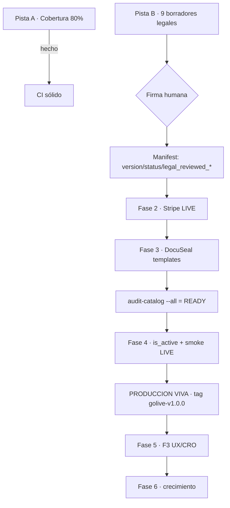

# Afiladocs — Roadmap técnico

> **Última actualización:** 2026-06-15 · **Rama:** `fix/post-merge-pin-main` (= `main` + 1) · **Tag:** `v1.0.0`
> **Estado global:** código de tienda funcional end-to-end en modo TEST. Bloqueante de producción = trabajo humano (firma legal + alta en Stripe LIVE / DocuSeal), **no código**.
> **Documento de planificación vivo:** `~/.claude/plans/an-lisis-completo-del-estado-zany-corbato.md`. Este ROADMAP es el resumen técnico versionado en el repo.

## Stack

Next.js 16.2.6 (App Router, RSC) · React 19 · TypeScript 5.8 strict · Tailwind v4 + shadcn/ui · Prisma 7 + `@prisma/adapter-pg` (Supabase Postgres) · Stripe SDK 21 (`2026-03-25.dahlia`) · DocuSeal (firma, self-hosted) · EasyVerifactu (RD 1007/2023) · Resend (email) · Upstash (rate-limit) · Sentry v10 + OTel · Vitest 4 + happy-dom · Playwright. Deploy: Vercel (`cdg1`), dominio `afiladocs.com`.

---

## Estado por eje (verificado en código, 2026-06-15)

| Eje                                | Estado        | Evidencia                                                                                                                     |
| ---------------------------------- | ------------- | ----------------------------------------------------------------------------------------------------------------------------- |
| Build / typecheck / lint           | ✅            | `npm run ci:local` EXIT 0; gates en `.github/workflows/ci.yml` (ubuntu-latest, Node 22)                                       |
| Tests                              | ✅            | **223 specs** (218 unit + 5 e2e), 36 suites en `src/__tests__/`                                                               |
| Cobertura forzada en CI            | ✅            | `vitest.config.ts` thresholds `82/68/80/83`; real **84.6% stmts / 85.6% lines / 83.4% funcs / 69.6% branches**                |
| Seguridad HTTP                     | ✅            | CSP nonce per-request + `strict-dynamic`, HSTS 2 años, bot/path-traversal en `middleware.ts`; `eslint-plugin-security` activo |
| Deuda de tipos                     | ✅            | 0 `any` / `@ts-ignore` / TODO / FIXME en `src/`                                                                               |
| Marketing (home, tienda, landings) | ✅            | RSC dinámico desde BD; Schema.org (LegalService, HowTo, FAQPage, Product) en `src/components/JsonLd.tsx`                      |
| Portal cliente                     | ✅            | KPIs, pedidos, intake, descarga firmada, Stripe Billing Portal                                                                |
| Panel Ops (F4)                     | ✅ 100%       | filtros, export CSV, cursor pagination, SLA percentiles, timeline audit_log en `src/app/ops/`                                 |
| Webhooks (Stripe/DocuSeal/n8n)     | ✅            | HMAC SHA-256, idempotencia por `*_event_id` en `audit_log`                                                                    |
| VeriFactu (RD 1007/2023)           | ✅            | `src/lib/verifactu/` cableado al webhook Stripe; **cubierto por tests**                                                       |
| Emails transaccionales             | ✅            | 13 plantillas React Email en `src/emails/`                                                                                    |
| Cron jobs                          | ✅            | 5 crons en `vercel.json` (cleanup, reminders×2, sla-monitor, daily-report)                                                    |
| F3 UX/CRO                          | 🟡 ~70%       | falta autosave intake; `/portal/cuenta` y `/portal/facturas` no existen (facturas → Stripe Portal)                            |
| F6 Crecimiento                     | 🟡 ~10%       | `src/lib/flags.ts` (Edge Config) existe sin consumidores; blog MDX retirado (301→`/`); sin i18n                               |
| **Catálogo / go-live P0b**         | ❌ bloqueante | 10 SKUs en `draft v0.1.0`, 0 con `stripe_price_id`, 0 con `docuseal_template_id`, 0 activos, 1/10 con borrador legal v1.0.0   |

---

## Avances de esta sesión (2026-06-15)

### Fase 0 — Saneo de CI ✅

- **Umbral de cobertura forzado** en `vitest.config.ts` (antes era aspiracional, no fallaba el build).
- **`eslint-plugin-security` activado** en `eslint.config.mjs`; `detect-object-injection` desactivado por ruidoso (resto de reglas activas). ESLint deja de escanear `.claude/**` y `coverage/**`.
- **`.nvmrc=22`** para alinear local con CI/Vercel (`engines: 22.x`).

### Pista A — Cobertura a 80% ✅

Cobertura **62.7% → 84.6% statements** (de 156 a 223 tests). Patrón consolidado: mock de `globalThis.fetch` y de módulos vía `vi.hoisted()`; routes con mock de `@/lib/prisma/client` + `next/cache`.

| Módulo                           | Antes | Después   | Test                                  |
| -------------------------------- | ----- | --------- | ------------------------------------- |
| `lib/verifactu/easyverifactu.ts` | 0%    | cubierto  | `verifactu-easyverifactu.test.ts`     |
| `lib/stripe/actions.ts`          | 0%    | cubierto  | `stripe-actions.test.ts`              |
| `lib/orders/fulfillment.ts`      | 12%   | cubierto  | `orders-fulfillment.test.ts`          |
| `lib/storage/templates.ts`       | 17%   | cubierto  | `storage-templates.test.ts`           |
| `lib/email/send.ts`              | 0%    | cubierto  | `email-send.test.ts`                  |
| `lib/signing/docuseal.ts`        | 60%   | **97%**   | `docuseal-adapter.test.ts` (ampliado) |
| `lib/prisma/orders.ts`           | 0%    | **100%**  | `prisma-orders.test.ts`               |
| `lib/supabase/storage.ts`        | 0%    | cubierto  | `supabase-storage.test.ts`            |
| `lib/auth.ts`                    | 0%    | cubierto  | `auth.test.ts`                        |
| `lib/alerts/notify-ops.ts`       | 0%    | cubierto  | `notify-ops.test.ts`                  |
| `lib/env.ts`                     | 34%   | 71%       | `env.test.ts` (ampliado)              |
| `api/health/route.ts`            | 0%    | 100%      | `health.test.ts`                      |
| `api/contact/route.ts`           | 62%   | branches+ | `contact.test.ts` (ampliado)          |

**Decisión de medición:** se excluyen del cálculo los wrappers de SDK puros (`prisma/client.ts`, `supabase/{client,server,service,middleware,lazy-client}.ts`) — testearlos solo mide el constructor de terceros, no lógica propia.

### Pista B — Borradores legales 🟡 1/9

- **`AFD-CIV-NDA-001`** generado a v1.0.0 completo (`draft-v1.0.0.md` 20 campos DocuSeal + `notes-legal.md`), al patrón de `AFD-RGPD-REG-001`. 3 TODOs resueltos + 11 observaciones. Pendiente firma humana.
- Marcado como **no verificado** lo no confirmable de memoria (reformas Ley 1/2019 / CP post-enero 2026).

---

## Próximas tareas

### P1 · Pista B — completar borradores legales (8 SKUs) 🟡

Replicar el patrón de REG-001/NDA. Cada uno: `draft-v1.0.0.md` (secciones + campos `{{snake_case}}` + checklist 13 pasos) + `notes-legal.md` (resolución TODOs + observaciones + límites). **Requiere firma humana del operador para cerrar.**

| SKU                    | Familia         | Delivery                 | eIDAS | Fuentes clave                                                                   |
| ---------------------- | --------------- | ------------------------ | ----- | ------------------------------------------------------------------------------- |
| `AFD-ARR-VIV-001`      | arrendamiento   | `docuseal_fill_and_sign` | AES   | LAU Título II (arts. 9-11 prórrogas)                                            |
| `AFD-ARR-TEMP-001`     | arrendamiento   | `docuseal_fill_and_sign` | AES   | LAU art. 3 (uso distinto de vivienda); jurisprudencia TS temporada vs turístico |
| `AFD-ARR-LOC-001`      | arrendamiento   | `docuseal_fill_and_sign` | AES   | LAU Título III; RD 2/2004 ITP-AJD                                               |
| `AFD-CIV-CPS-001`      | civil           | `docuseal_fill_and_sign` | AES   | CC arts. 1544, 1583-1587; límite laboral                                        |
| `AFD-RGPD-POL-001`     | rgpd            | `docuseal_fill_and_sign` | AES   | RGPD arts. 13-14; LSSI-CE art. 10; EDPB 5/2020                                  |
| `AFD-RGPD-CES-001`     | rgpd            | `docuseal_fill_and_sign` | AES   | RGPD art. 28; SCC UE 2021/915                                                   |
| `AFD-RGPD-BASE-001`    | rgpd (pack ZIP) | `download_after_payment` | —     | Depende de REG-001 + POL-001                                                    |
| `AFD-REV-CONTRACT-001` | review          | `human_review`           | —     | Solo `notes-legal.md` (servicio, sin DOCX/template)                             |

### P2 · Fase 2 — Stripe LIVE automatizado

- **`scripts/stripe-create-live.ts`** (nuevo, idempotente, `--dry-run`): crea 10 productos+precios EUR `one_time` en LIVE con metadata `sku`/`afiladocs_category`/`eidas_level`; busca por `metadata.sku` antes de crear. Vuelca `stripe_price_id` a `prisma/seeds/products.json`.
- Rotar `STRIPE_WEBHOOK_SECRET` LIVE + actualizar en Vercel.
- ⚠️ Stripe LIVE = dinero real: confirmar antes de ejecutar; reembolsar smoke tests.

### P3 · Fase 3 — DocuSeal templates

- 8 templates (NDA, 3 ARR, CPS, POL, CES, REG) desde los DOCX maquetados. `AFD-RGPD-BASE-001` (pack ZIP) y `AFD-REV-CONTRACT-001` (human_review) no llevan template.
- Script `scripts/docuseal-sync.ts` si la API lo permite; si no, alta manual vía `/ops/productos`.

### P4 · Fase 4 — Activación + smoke test (HITO: producción viva)

1. Gate duro: `npx tsx scripts/audit-catalog.ts --all` → READY en todos los SKUs poblados (`checkLegalReview()` en `scripts/audit-catalog.ts:121` solo bloquea en `status=live`).
2. `is_active=true` solo con ambos IDs presentes.
3. Smoke test E2E LIVE: 1 SKU por cada `delivery_mode` (checkout → webhook → VeriFactu → email → DocuSeal → descarga). Reembolsar.
4. Tag `catalog/golive-v1.0.0`.

### P5 · Fase 5 — Cerrar F3 UX/CRO (post-producción)

- Autosave intake en `src/app/portal/pedido/[id]/intake/IntakeForm.tsx` (hoy submit-on-click).
- Decisión `/portal/cuenta` + `/portal/facturas`: crearlas o documentar oficialmente que viven en Stripe Portal (hoy hay discrepancia doc↔código).

### P6 · Fase 6 — Crecimiento (on-demand)

- Dar uso real a `src/lib/flags.ts`; blog MDX solo si lo justifica SEO; i18n ES/CA con `next-intl` si hay demanda.

---

## Deuda técnica registrada

| Severidad | Ítem                      | Detalle                                                                                                |
| --------- | ------------------------- | ------------------------------------------------------------------------------------------------------ |
| MEDIA     | Branch coverage 69.6%     | A una décima del objetivo 70; threshold en 68. Subir con 1-2 tests de branch.                          |
| MEDIA     | 15 vulns npm (3 high)     | `npm audit` — revisar antes de go-live.                                                                |
| BAJA      | 3 warnings de complejidad | `middleware.ts` (12), `scripts/audit-catalog.ts` (`checkStripe` 12, `main` 11). Máximo configurado 10. |
| BAJA      | Ramas locales sin podar   | ~18 ramas `feat/*`/`fix/*` sin integrar.                                                               |
| BAJA      | Drift doc↔código          | `docs/00-ESTADO-ACTUAL.md` (validado 2026-04-18) subestima lo hecho; actualizar al cerrar cada fase.   |
| INFO      | Toolchain local           | Node 24 local vs 22 canónico (CI/Vercel/`engines`). `.nvmrc` añadido.                                  |

---

## Secuencia hasta producción



## Verificación

```bash
npm ci
npm run ci:local                          # check:env + typecheck + lint + test:coverage + build
npx tsx scripts/audit-catalog.ts --all    # READY en SKUs poblados
npm run test:e2e                          # Playwright (Chromium)
```
